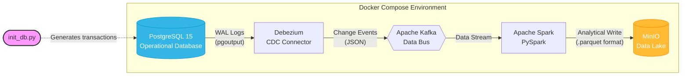

# Real-Time CDC Data Pipeline

## Project Description
This project implements a Change Data Capture (CDC) architecture for real-time stream processing. It captures changes from a relational operational database and automatically builds an analytical Data Lake using the Parquet format, ensuring zero performance impact on the business application.

## Architecture and Technologies
* **PostgreSQL 15:** Operational database with logical replication enabled (`pgoutput`).
* **Debezium:** CDC tool capturing transactions directly from the database's WAL (Write-Ahead Log).
* **Apache Kafka:** Distributed data bus buffering events (configured in KRaft mode).
* **Apache Spark (PySpark):** Analytical cluster aggregating data using Structured Streaming.
* **MinIO:** Local object storage (Amazon S3 compatible) serving as the target Data Lake.
* **Docker Compose:** Orchestration and containerization of the entire environment.

## Project Structure
* `docker-compose.yml` - Infrastructure and network definition.
* `init_db.py` - Python startup script generating business traffic.
* `postgres-connector.json` - Configuration file (payload) for the Debezium connector.
* `spark/app/stream_job.py` - Analytical application transforming nested JSON structures into a columnar format.



## Prerequisites
* Docker Desktop 
* Python 3.x with database client libraries installed

## Setup Instructions

### 1. Start the Infrastructure
```bash
docker compose up -d
```

### 2. Configure the Data Lake
Open `http://localhost:9001` in your browser (username: `admin`, password: `password123`). 
Create a new bucket named `datalake`.

### 3. Generate Initial Data
```bash
python init_db.py
```

### 4. Start Change Data Capture (Debezium)
```bash
curl.exe -i -X POST http://localhost:8083/connectors -H "Content-Type: application/json" --data "@postgres-connector.json"
```

### 5. Activate the Analytics Engine (Spark)
```bash
docker compose restart spark-app
docker logs -f spark-app
```

## Verification
Open the MinIO web interface and navigate to the `datalake` bucket. Inside the `customers/raw/` directory, you will find the compressed `.parquet` files. Each subsequent execution of the `init_db.py` script will add a new batch of processed data to this location after the defined interval (10 seconds).

## Teardown and Cleanup
```bash
docker compose down -v
```
